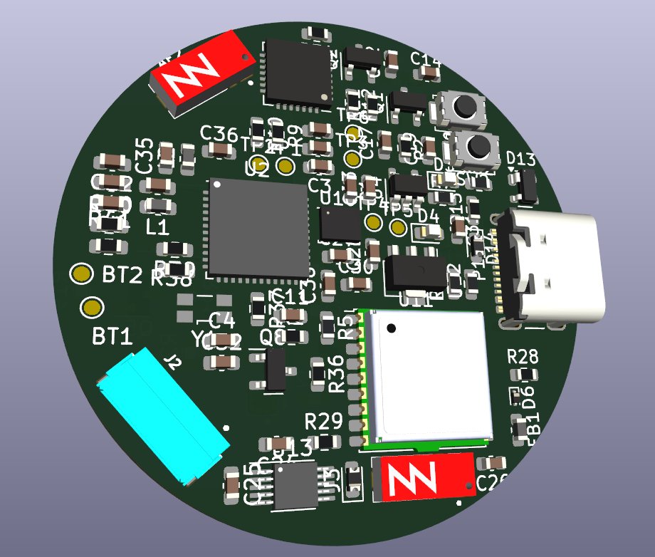
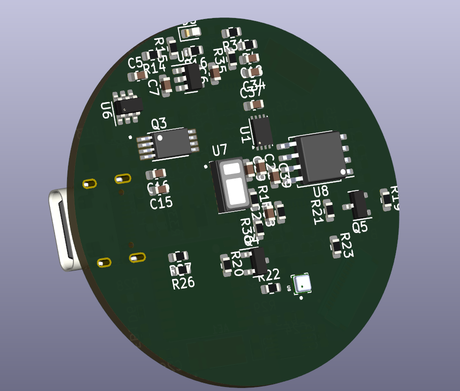

# Smart-Watch (ESP32-PICO-D4)

A comprehensive open-source smart-watch project featuring high-end sensors, GPS integration, and a sleek hardware design. This project is built around the **ESP32-PICO-D4** System-in-Package, providing a compact yet powerful core for wearable applications.

<p align="center">
  
</p>
<p align="center">
  
</p>
## 🚀 Features

- **Core Processor**: ESP32-PICO-D4 (Dual-core, Wi-Fi & Bluetooth, integrated Flash).
- **Navigation**: u-blox **MAX-M10S** GNSS module for high-precision positioning.
- **Health Monitoring**: **MAX30102/30105** sensor for heart rate and pulse oximetry.
- **Motion Tracking**: **LSM6DSO/LSM6DS3** 6-axis IMU (Accelerometer + Gyroscope).
- **Environment**: **BMP388** barometric pressure sensor for altitude and weather tracking.
- **Haptics**: **DRV2605L** haptic driver for sophisticated vibration patterns.
- **Storage & Memory**: 
  - 128Mbit external SPI Flash (**W25Q128**).
  - 64Mbit external QSPI PSRAM (**APS6404L**).
- **Power Management**:
  - USB-C charging via **MCP73831** Li-Po charger.
  - Integrated battery protection using **AP9101C**.
  - High-efficiency LDOs for stable rail regulation.
- **Connectivity**: USB-to-UART via **CP2102N** for easy programming and debugging.

## 📂 Repository Structure

```text
├── firmware/                 # ESP-IDF based driver  implementations and test apps
│   ├── bmp388/               # Barometric sensor test code
    ├── lsm6dso_i2c/          # 6-axis IMU I2C    
    |
    ├── max30102/             # Heart rate sensor 
    └── max_m10s/             # GNSS/GPS driver and esting
├── PCB_Files/                # KiCad Hardware Design Files
│   ├── watch.kicad_sch       # Main Schematic
│   ├── watch.kicad_pcb       # PCB Layout
│   └── watch.csv             # Bill of Materials (BOM)
└── footprints_schematics/    # Custom KiCad libraries and footprints
```

## 🛠️ Hardware Setup

The hardware is designed using **KiCad**. You can find the full schematics and PCB layout in the `PCB_Files` directory.

### Key Components
- **MCU**: [ESP32-PICO-D4](https://www.espressif.com/sites/default/files/documentation/esp32-pico-d4_datasheet_en.pdf)
- **GNSS**: [u-blox MAX-M10S](https://content.u-blox.com/sites/default/files/MAX-M10S_DataSheet_UBX-20035208.pdf)
- **IMU**: [ST LSM6D3](https://www.st.com/resource/en/datasheet/lsm6ds3tr-c.pdf)
- **Pressure**: [Bosch BMP388](https://www.bosch-sensortec.com/media/boschsensortec/downloads/datasheets/bst-bmp388-ds001.pdf)

## 💻 Firmware Development

The firmware is developed using the **ESP-IDF** (Espressif IoT Development Framework).

### Prerequisites
- Install [ESP-IDF SDK](https://docs.espressif.com/projects/esp-idf/en/latest/esp32/get-started/index.html) (v4.4 or later recommended).

### Building a Component
To build and flash one of the test apps (e.g., the GPS module):
```bash
cd firmware/max_m10s
idf.py build
idf.py -p [PORT] flash monitor
```

## 🎨 Design Aesthetics
The PCB design focuses on a compact circular/watch-friendly form factor with optimized trace routing for high-speed signals (Flash/PSRAM) and sensitive analog paths (Heart Rate sensor).
